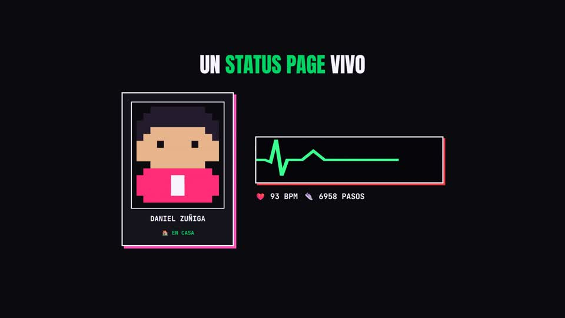

# galaxy-vitals-bridge

App Android mínima: lee heart rate, SpO2, pasos, pisos subidos, sueño y el
último ejercicio directo de **Samsung Health** (vía el Samsung Health Data
SDK, no Health Connect) y los publica en
[danzuniga.xyz/status](https://danzuniga.xyz/status/) — mismo endpoint y
schema base que usa el script de BLE del portfolio (`sync_vitals.py`), así
que ambas fuentes son intercambiables.

[](https://github.com/danielzunigazb/galaxy-vitals-bridge/releases/download/showcase-v1/GalaxyVitalsShowcase.mp4)
<p><sub>▶ <a href="https://github.com/danielzunigazb/galaxy-vitals-bridge/releases/download/showcase-v1/GalaxyVitalsShowcase.mp4">Video de presentación</a> — GitHub no reproduce mp4 de releases inline en el README, así que el link abre/descarga el video directo.</sub></p>

## Por qué Samsung Health Data SDK y no Health Connect

La primera versión leía de Health Connect. En la práctica, en un teléfono
no-Samsung (probado en un OPPO) Samsung Health nunca sincroniza datos hacia
Health Connect — el toggle de permiso de escritura aparece activado, pero
Health Connect siempre devuelve cero registros, incluso pidiendo 7 días de
historial. El Samsung Health Data SDK lee directo de la app de Samsung
Health por IPC, sin depender de ese puente roto.

## Cómo está armado

- `MainActivity.kt` — UI en Compose: pegás el token de GitHub, pedís permiso
  de Samsung Health, y podés forzar un sync manual.
- `SamsungHealthRepository.kt` — lee heart rate (últimos 30 min), SpO2
  (últimas 24h), pasos y pisos subidos de hoy, la última sesión de sueño
  (últimas 48h) y el último ejercicio registrado (últimos 7 días).
- `GitHubPublisher.kt` — el mismo PUT a la Contents API que hace
  `sync_vitals.py`, sobre `danielzunigazb/portfolio`, rama `data`.
- `VitalsSyncWorker.kt` — `WorkManager` periódico (cada 15 min, el mínimo que
  permite Android para trabajo periódico).
- `TokenStore.kt` — el token de GitHub y los tokens de Spotify se guardan con
  `EncryptedSharedPreferences`, solo en este dispositivo. Nunca se commitean
  ni se mandan a ningún lado más que a sus respectivas APIs.
- `SpotifyAuth.kt` / `SpotifyRepository.kt` — OAuth (Authorization Code +
  PKCE, sin client secret) y lectura de "currently playing". Corre en el
  propio dispositivo, sin depender de ningún servicio externo.
- `LocationZoneRepository.kt` — clasifica la ubicación actual como
  `"casa"` / `"escuela"` / `"afuera"` comparando contra dos puntos que se
  guardan a mano desde la app (radio de 150m). Las coordenadas viven solo
  en `SharedPreferences` locales — nunca se publica ni un lat/lng.
- `app/libs/samsung-health-data-api-1.1.0.aar` — el SDK de Samsung, no está
  en Maven Central así que va commiteado directo en el repo.

## Setup

1. Abrí la carpeta en Android Studio (Open → esta carpeta).
2. **Activá el modo desarrollador del SDK en Samsung Health, en el celular
   donde vas a correr la app** (ver abajo — sin esto el permiso de lectura
   nunca se concede).
3. Conectá tu celular por USB con depuración USB activada (minSdk 29,
   Android 10+; necesita Samsung Health instalado, funciona aunque el
   teléfono no sea Samsung).
4. Run. La primera vez:
   - Pegá un GitHub fine-grained PAT con permiso **Contents: Read and write**
     sobre `danielzunigazb/portfolio` únicamente, y tocá "Guardar token".
   - Tocá "Pedir permiso de heart rate" y aceptá el diálogo de consentimiento
     de Samsung Health (heart rate, SpO2, pasos, pisos subidos, sueño,
     ejercicio).
   - Tocá "Sync ahora" para probar que publique.
5. Confirmá en `danzuniga.xyz/status` que pase a "● LIVE".

Después de esto, `VitalsSyncWorker` sigue solo cada 15 min en background,
sin necesidad de tener la app abierta.

### Activar el modo desarrollador de Samsung Health

Paso obligatorio en cada celular donde se instale la app, mientras el SDK
no esté registrado como partner ante Samsung (ver Notas):

1. Abrí Samsung Health → ⋮ (arriba a la derecha) → **Configuración → Acerca
   de Samsung Health**.
2. Tocá la línea de la versión **10 veces seguidas**, rápido.
3. Aparece **"Developer mode (Samsung Health Data SDK)"** → tocalo → aceptá
   el aviso → activá **"Developer Mode for Data Read"**.

## Conectar Spotify (now playing)

Opcional — sin esto, `now_playing` simplemente no aparece en el JSON y
`/status` muestra "nada sonando ahora". Con esto conectado, es permanente:
corre en tu propio celular, no depende de ninguna sesión de Claude ni de
ningún cron externo.

1. Andá a [developer.spotify.com/dashboard](https://developer.spotify.com/dashboard),
   entrá con tu cuenta de Spotify → **Create app**.
2. Nombre/descripción: lo que quieras. **Redirect URI**: pegá exactamente
   `galaxyvitalsbridge://callback`. API a usar: **Web API**. Guardá.
3. En la página del app, copiá el **Client ID** y pegalo en
   `SpotifyAuth.kt`, reemplazando `SpotifyConfig.CLIENT_ID`.
4. Los apps nuevos de Spotify arrancan en **Development Mode**, que solo
   deja loguearse a usuarios explícitamente agregados (hasta 25). Si al
   tocar "Conectar Spotify" el login te rebota, andá a **Settings → User
   Management** en el dashboard del app y agregá tu propio email de
   Spotify.
5. Corré la app, tocá **Conectar Spotify**, iniciá sesión/aceptá el
   permiso (`user-read-currently-playing`) — te manda de vuelta a la app
   sola. Tocá "Sync ahora" para confirmar.

El `access_token` dura 1h y se refresca solo con el `refresh_token` en cada
sync — no hay que volver a loguearse a mano salvo que revoques el acceso
desde tu cuenta de Spotify.

## Configurar zonas de ubicación (casa/escuela/afuera)

Opcional — sin esto, `location_zone` siempre publica `"afuera"`. La app
**nunca** manda coordenadas: solo la categoría, calculada en el propio
teléfono.

1. Tocá **"Pedir permiso de ubicación"** y aceptá los dos diálogos
   (ubicación normal, y después "Permitir todo el tiempo" para que
   funcione durante el sync automático en background — en Android 11+
   puede mandar a Ajustes en vez de mostrar el diálogo directo).
2. Parado en tu casa: tocá **"Guardar como Casa"**.
3. Parado en tu escuela: tocá **"Guardar como Escuela"**.

Listo — `VitalsSyncWorker` calcula la zona en cada sync comparando la
ubicación actual contra esos dos puntos (radio de 150m) y publica solo el
resultado (`"casa"` / `"escuela"` / `"afuera"`).

## JSON publicado

```json
{
  "heart_rate_bpm": 80,
  "oxygen_saturation_pct": 98,
  "steps_today": 4600,
  "floors_climbed_today": 3,
  "sleep_duration_minutes": 452,
  "sleep_score": 64,
  "last_exercise": { "type": "RUNNING", "duration_minutes": 32, "calories": 210.5, "mean_heart_rate_bpm": 142 },
  "battery_pct": null,
  "location_zone": "casa",
  "updated_at": "2026-09-20T19:58:45Z",
  "source": "galaxy-fit3-samsunghealth",
  "now_playing": {
    "is_playing": true,
    "track": "WAQI",
    "artists": "GROSSOMODDO, Montaigne",
    "album": "WAQI",
    "cover_url": "https://i.scdn.co/image/...",
    "url": "https://open.spotify.com/track/...",
    "updated_at": "2026-09-20T19:58:45Z"
  }
}
```

Cualquier campo sin dato reciente va en `null` (o `last_exercise` completo en
`null` si no hay ejercicio registrado en la última semana). `battery_pct`
siempre es `null` — no es un dato de salud/fitness, ningún SDK de Health lo
expone (la vía BLE directa de `sync_vitals.py` sí puede traerlo). `now_playing`
solo aparece si Spotify está conectado (ver abajo) — si no, se omite entero.

## Notas

- **El modo desarrollador es solo para pruebas.** Funciona indefinidamente
  para tu propio uso en tu propio teléfono. Si algún día se va a distribuir
  esta app a otras personas (Play Store o APK a terceros), hay que registrar
  el paquete + firma (SHA-256) como partner ante Samsung
  ([developer.samsung.com/health/data](https://developer.samsung.com/health/data/overview.html))
  para que el permiso de lectura funcione sin el modo desarrollador activado
  a mano.
- Si Gradle falla con `Daemon compilation failed` / `IllegalArgumentException: 25.0.3`:
  es el compilador de Kotlin 1.9.24 cayéndose al usar un JDK 24+ (el JBR que
  trae Android Studio). Ya está mitigado con `kotlin.incremental=false` en
  `gradle.properties`.
- Si el proyecto vive dentro de una carpeta sincronizada por OneDrive/Drive/
  Dropbox, `build.gradle.kts` ya redirige todos los `buildDir` (root y
  subproyectos) a `%LOCALAPPDATA%/gradle-builds/galaxy-vitals-bridge`, fuera
  de la carpeta sincronizada — el `Unable to delete directory` /
  `AccessDeniedException` que daba antes era el sincronizador compitiendo por
  los archivos de `app/build` con Gradle, no un bug del proyecto.

## Tests

`app/src/test/` — lógica pura, sin emulador ni Robolectric (corre en la JVM
del host):

- `LocationZoneRepositoryTest` — clasificación de zona vía Haversine
  (radio, prioridad de zona, casos límite).
- `SamsungHealthRepositoryTest` — que una siesta nunca pise el sueño real
  (el bug que se reportó en producción).
- `GitHubPublisherTest` — forma del JSON publicado (nulls explícitos,
  `now_playing` omitido si Spotify no está conectado, nunca se cuela un
  lat/lng).
- `VitalsWidgetProviderTest` — el widget se marca `⚠ desactualizado` a
  partir de 3 syncs periódicos perdidos (45 min).

```bash
./gradlew :app:testDebugUnitTest
```
